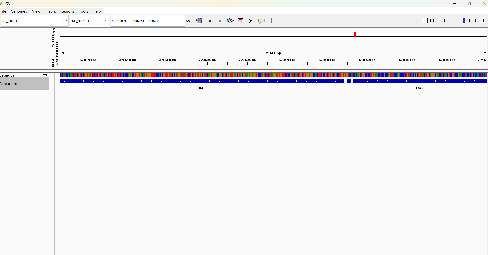
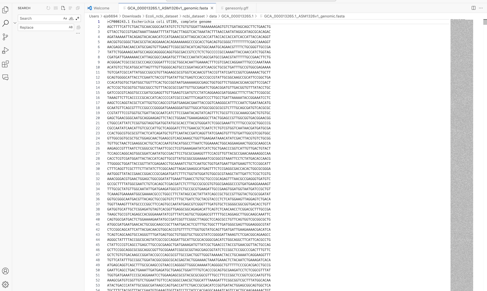

The genome for Escherichia coli UTI89 was downloaded, and the corresponding FASTA file was successfully opened in a text editor to verify its contents. The genome sequence consisted of nucleotide sequences in the proper FASTA format, starting with the header line indicating the organism and strain (screenshot labelled- Genome).

# Downloading the E. coli UTI89 genome FASTA file
```bash
wget ftp://ftp.ncbi.nlm.nih.gov/genomes/all/GCF/000/026/625/GCF_000026625.1_ASM2662v1_genomic.fna.gz
```

# Downloading the GFF file for gene annotations

```bash
wget ftp://ftp.ncbi.nlm.nih.gov/genomes/all/GCF/000/026/625/GCF_000026625.1_ASM2662v1_genomic.gff.gz
```
# files were unzipped using the gunzip command

```basha
gunzip GCF_000026625.1_ASM2662v1_genomic.fna.gz
gunzip GCF_000026625.1_ASM2662v1_genomic.gff.gz
```

The downloaded GFF file contained various features, including CDS, ribosome entry sites, and gene features etc. Using VS code, the GFF file was opened, and intervals corresponding to the "gene" feature were identified and extracted.A new file, genesonly.gff was created by isolating all the lines where the third column indicated gene, ensuring that only gene-related annotations were retained.


Loading Files in IGV 

The FASTA file and annotated file were loaded into IGV for genome visualization.IGV displayed the genome track and allowed zooming into the genome to visualize specific regions. The gene annotations were successfully aligned with the genome, and specific genes such as "ttdT" and "tsaD" were visible upon zooming into particular regions of the genome

## Visualization 

### Image 1: IGV Image
The following image shows the genome visualization in IGV:



### Image 2: Genome
This image shows the overall genome:



### Image 3: Genes Only
This image represents the gene annotations filtered from the GFF file:


