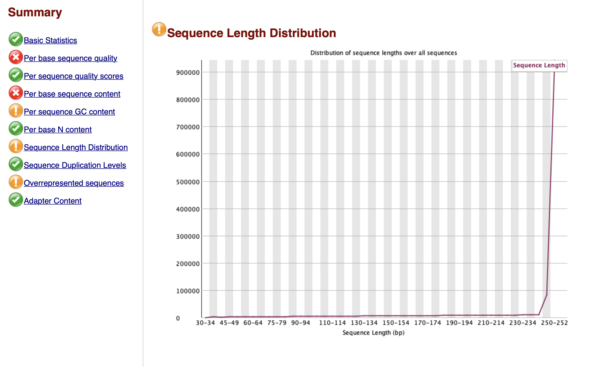
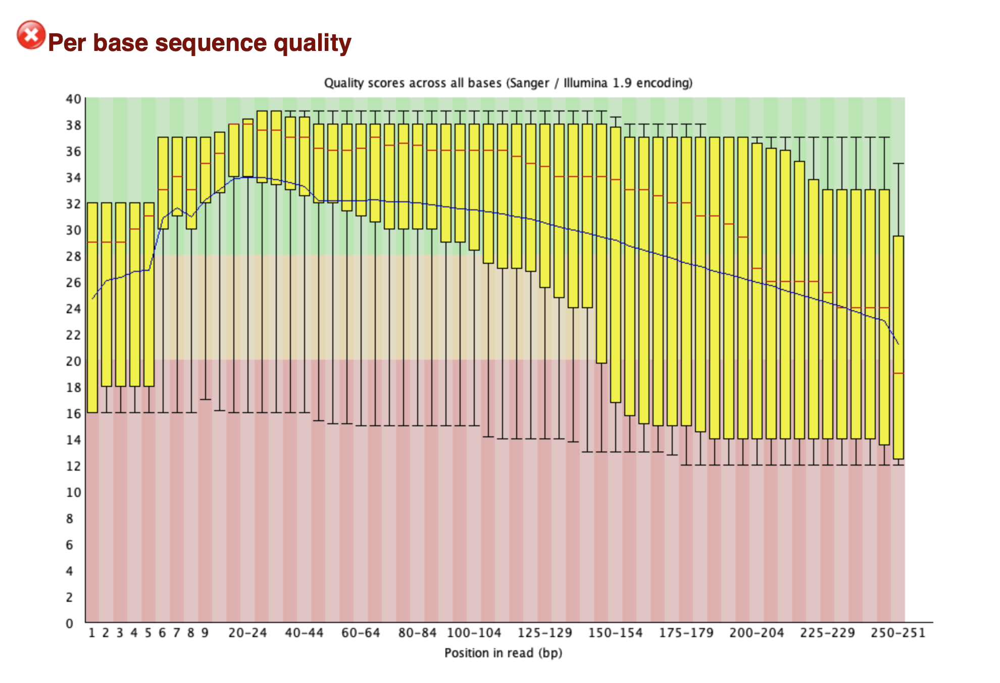
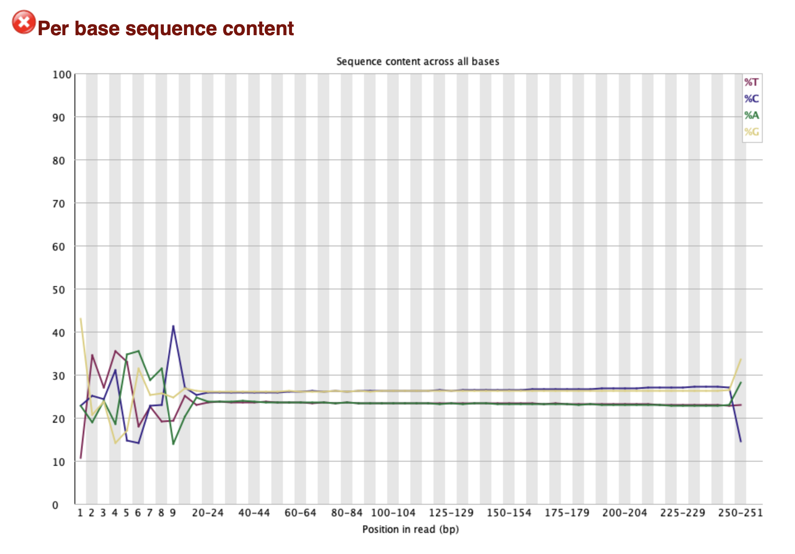
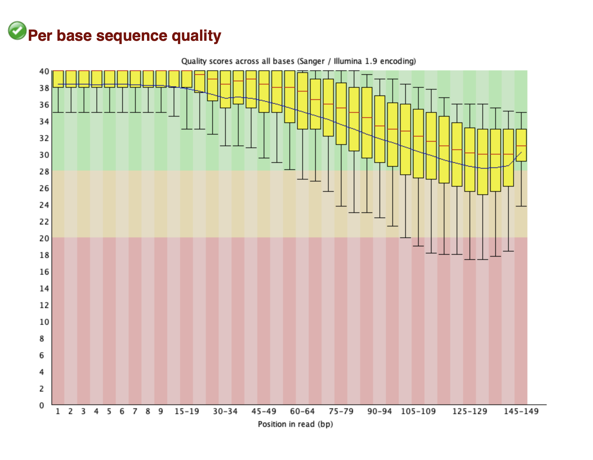
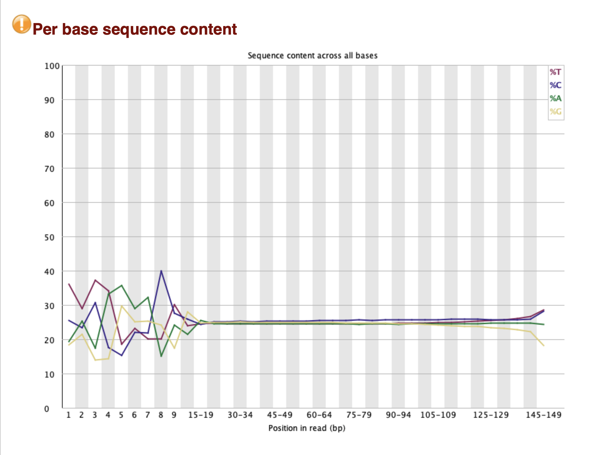
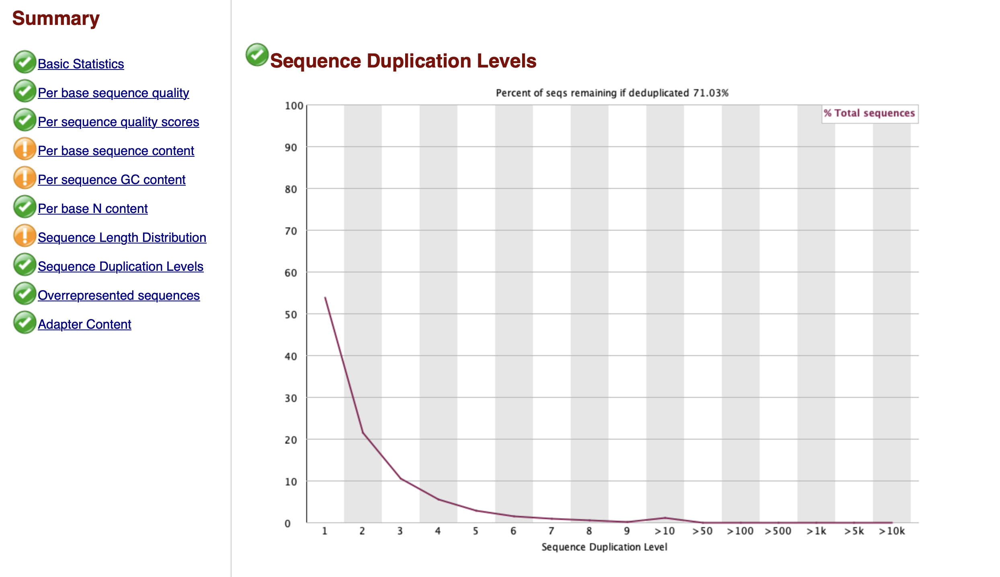

#### FASTQ Quality Control Report

#### Data 
   - **Organism**: *Escherichia coli*
   - **SRA Accession**: SRR30895571
 Publication link: https://pubmed.ncbi.nlm.nih.gov/25888672/


#### Download data from SRA
```bash
fastq-dump --split-files SRR2033906
```

#### Initial Qc 
```bash
fastqc SRR2033906_1.fastq SRR2033906_2.fastq
```

#### Report 

### Image 1: Per base sequence quality (before trimming)


### Image 2: Per base sequence content (before trimming)


### Image 3: Sequence length distribution (before trimming)



### Trim Reads
```bash
fastp -i SRR2033984_1.fastq -o SRR2033984_1_trimmed.fastq -I SRR2033984_2.fastq -O SRR2033984_2_trimmed.fastq
```

### fast Qc on trimmed reads

```bash
fastqc SRR2033984_1_trimmed.fastq SRR2033984_2_trimmed.fastq
```

#### Report 

### Image 4: Per base sequence quality (after trimming)


### Image 5: Per base sequence content (after trimming)


### Image 6: Sequence length distribution (after trimming)



Conclusion 

After trimming the E. coli sequence, the quality of both reads improved significantly. For Read 1, the percentage of bases with a Q20 score increased from approximately 85% to 95-97%, and those with a Q30 score improved from around 75% to 85-88%. Similarly, for Read 2, the proportion of bases with a Q20 score rose from about 83% to 94-96%, while Q30 scores increased from about 73% to 83-86%. The trimming process effectively removed low-quality regions, resulting in a much higher percentage of high-quality bases.