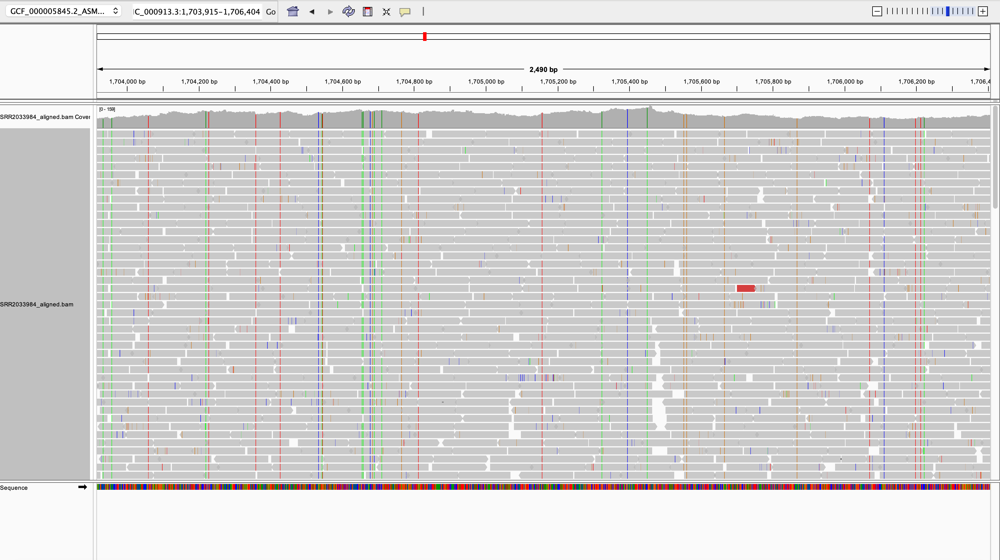

Assignment 8

### How to run files 

#### Download genome

```bash
make genome 
```

#### Download SRA reads

```bash
make download
```

#### QC raw reads

```bash
make raw_qc:
```

#### Trim reads

```bash
make trim
```

#### Qc trimmed reads

```bash
make qc
```

#### Index

```bash
make index
```

#### Allign

```bash
make allign
```

#### Allign


```bash
make stats
```

#### Image 1: Per base sequence quality (before trimming)


####  Alligned Statistics 

4429820 + 0 in total (QC-passed reads + QC-failed reads)
4422968 + 0 primary
0 + 0 secondary
6852 + 0 supplementary
0 + 0 duplicates
0 + 0 primary duplicates
3410926 + 0 mapped (77.00% : N/A)
3404074 + 0 primary mapped (76.96% : N/A)
4422968 + 0 paired in sequencing
2211484 + 0 read1
2211484 + 0 read2
3327964 + 0 properly paired (75.24% : N/A)
3348882 + 0 with itself and mate mapped
55192 + 0 singletons (1.25% : N/A)
0 + 0 with mate mapped to a different chr
0 + 0 with mate mapped to a different chr (mapQ>=5)
